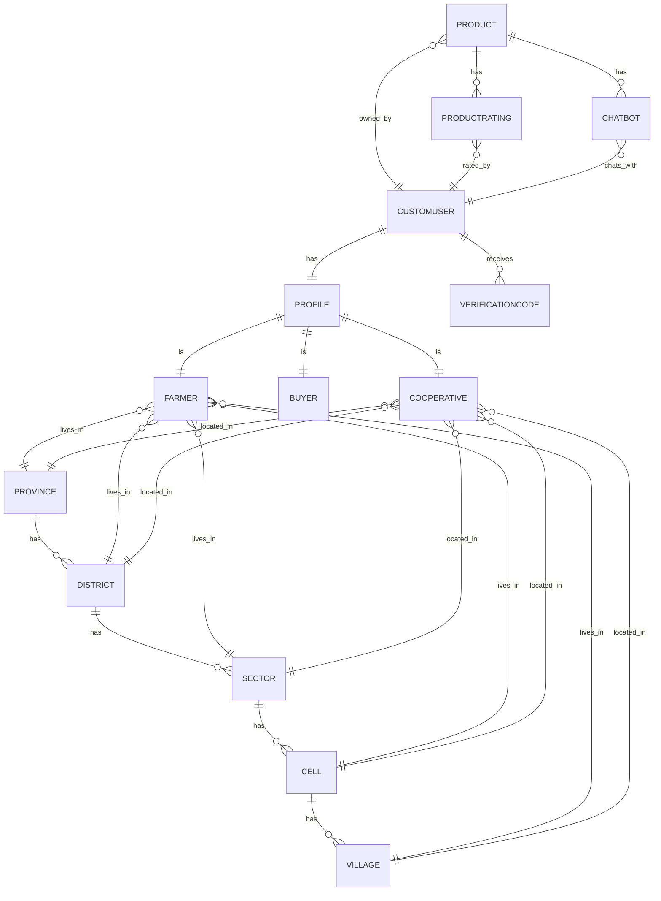
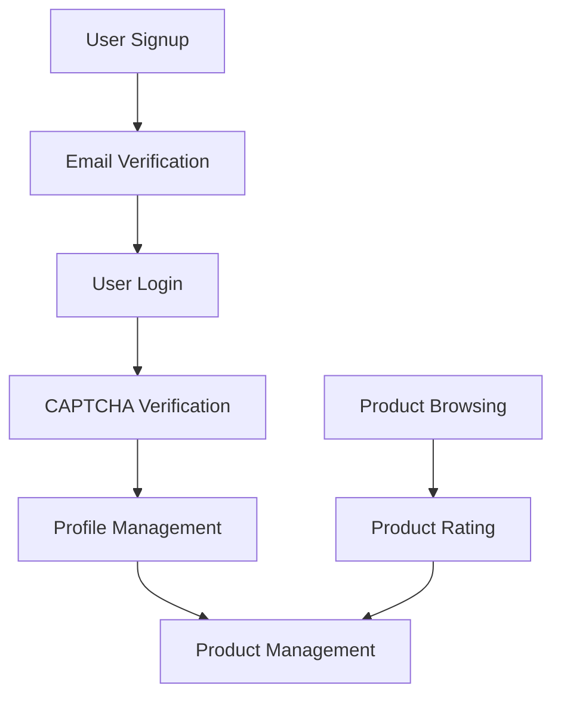

# AgriConnect

AgriConnect is a comprehensive agricultural marketplace platform designed to connect farmers, buyers, and cooperatives in Rwanda. It provides a modern, user-friendly interface for product listings, real-time communication, and market insights.

## Features

### User Authentication & Profile Management
- **Multi-role Signup**: Register as a farmer (umuhinzi), buyer (umuguzi), or cooperative
- **Email Verification**: Secure two-step verification process with email codes
- **Profile Management**: Edit profile details, location information, and contact details
- **Location-based Profiles**: Detailed location tracking (Province → District → Sector → Cell → Village)
- **Account Deletion**: Option to delete account with confirmation

### Product Management
- **Rich Product Listings**: Add products with images/videos, descriptions, and pricing
- **Dynamic Filtering**: Advanced search and filter system by location and keywords
- **Product Categories**: Organized by units (kg, g, l, unit)
- **Media Support**: Upload images and videos for product visualization
- **Edit & Delete**: Full control over product listings

### Location-based Features
- **Hierarchical Location System**: Rwanda's administrative structure
- **Smart Filtering**: Filter products by any location level
- **Dynamic Dropdowns**: Cascading location selection
- **Location Validation**: Ensures accurate location data
- **Geolocation Support**: Automatic location detection and manual input options

### Interactive Features
- **AI Chatbot**: Intelligent assistant for product inquiries and information
- **Product Ratings**: 5-star rating system with user feedback
- **Interactive UI**: Modern, responsive design with hover effects and animations

### User Experience
- **Responsive Design**: Works seamlessly on all devices
- **Multi-language Support**: English and Kinyarwanda interface
- **Modern UI**: Clean, intuitive interface with smooth animations
- **Jazzmin Admin**: Enhanced admin interface with modern design

### Security Features
- **Email Verification**: Required for account activation
- **Secure Authentication**: JWT-based authentication
- **Role-based Access**: Different permissions for different user types
- **Data Validation**: Comprehensive input validation and sanitization
- **CAPTCHA Protection**: Prevents automated form submissions

## Technical Stack

### Backend
- **Django 5.1.3**: High-level Python web framework
- **Django REST Framework**: API development
- **Channels**: WebSocket support for real-time features
- **PostgreSQL**: Robust database system
- **JWT Authentication**: Secure user authentication
- **Redis**: Caching and session management

### Frontend
- **Bootstrap 5**: Modern CSS framework
- **JavaScript**: Dynamic UI interactions
- **Font Awesome**: Icon library
- **Custom CSS**: Enhanced UI/UX
- **Widget Tweaks**: Enhanced form rendering

### Development Tools
- **Git**: Version control
- **Python Virtual Environment**: Dependency management
- **Django Debug Toolbar**: Development debugging
- **WhiteNoise**: Static file serving
- **CORS Headers**: Cross-origin resource sharing
- **Gunicorn**: Production-grade WSGI server

## Entity-Relationship Diagram

Below is the Entity-Relationship (ER) diagram representing the main data entities and their relationships in the project:



## Data Flow Diagram

The key data flows in the system are:

1. **User Authentication and Verification**
   - Users sign up with roles and contact details.
   - Email verification codes are generated and validated.
   - Users log in and access role-based dashboards.

2. **Product Management**
   - Users (farmers, cooperatives) add, edit, delete products.
   - Products include details, media, location coordinates.
   - Buyers browse and rate products.

3. **Profile and Location Management**
   - Users maintain profiles with roles and contact info.
   - Location hierarchy (Province > District > Sector > Cell > Village) is used to specify user and product locations.

4. **Product Rating**
   - Buyers rate products, with ratings linked to both product and user.



---

For more details, refer to the models in `core/models.py` and views in `core/views.py`.

## Installation

1. **Clone the repository**:
   ```bash
   git clone https://github.com/yourusername/AgriConnect.git
   cd AgriConnect
   ```

2. **Set up virtual environment**:
   ```bash
   python3 -m venv venv
   source venv/bin/activate  # On Windows: venv\Scripts\activate
   ```

3. **Install dependencies**:
   ```bash
   pip install -r requirements.txt
   ```

4. **Configure environment variables**:
   Create a `.env` file with:
   ```
   SECRET_KEY=your_secret_key
   DEBUG=True
   DB_NAME=your_db_name
   DB_USER=your_db_user
   DB_PASSWORD=your_db_password
   DB_HOST=localhost
   DB_PORT=5432
   EMAIL_HOST_USER=your_email
   EMAIL_HOST_PASSWORD=your_email_password
   ```

5. **Database setup**:
   ```bash
   python manage.py makemigrations
   python manage.py migrate
   ```

6. **Run the server**:
   ```bash
   python manage.py runserver
   ```

## Usage

1. **Access the Platform**:
   - Open `http://localhost:8000` in your browser
   - Register as a farmer, buyer, or cooperative
   - Verify your email using the sent code

2. **For Farmers/Cooperatives**:
   - Add products with details and media
   - Manage your product listings
   - Respond to buyer inquiries
   - Update location information

3. **For Buyers**:
   - Browse products with advanced filters
   - Use the chatbot for product inquiries
   - Rate products after purchase
   - View seller profiles and contact information

## Contributing

1. **Fork the repository**
2. **Create a feature branch**:
   ```bash
   git checkout -b feature/your-feature-name
   ```
3. **Commit your changes**:
   ```bash
   git commit -m "Add your feature"
   ```
4. **Push to the branch**:
   ```bash
   git push origin feature/your-feature-name
   ```
5. **Create a Pull Request**

## License

This project is licensed under the MIT License - see the LICENSE file for details.

## Support

For support, email rangiradave6@gmail.com or create an issue in the repository.
